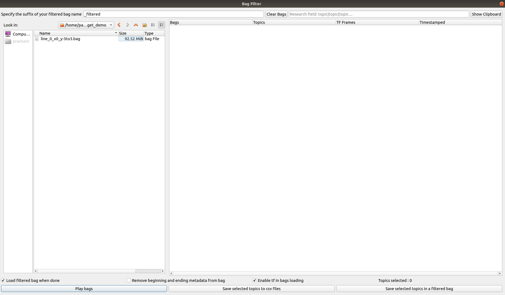
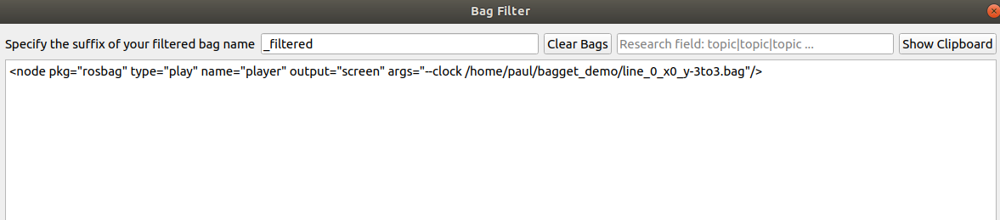

[](https://zenodo.org/badge/latestdoi/373238734)

# BagGetFilter
BagGetFilter utility is a simple, user friendly interface to manipulate rosbags. The user can **play rosbags**, **filter bags, and export topics into CSV format**.

## Installation

**For users**:


Download the executable using python3 at this <h1> [Download link](https://drive.google.com/file/d/10PXrukzT1F9a9hIVJkHOXgl6tUQOg7VS/view?usp=sharing)</h1>

If you use this software please cite as follows:
```
@software{Buzaud_BagGetFilter_A_simple_2021,
author = {Paul Buzaud, J. Humberto Ramos, Prashant Ganesh, Kevin Brink},
doi = {10.5281/zenodo.6334972},
month = {10},
title = {{BagGetFilter: A simple user friendly interface to manipulate ROSbags}},
url = {https://github.com/uf-reef-avl/BagGetFilter},
version = {1.0},
year = {2021}
}
```

**For developers**:

Clone the BagGetFilter's remote repository to your computer.

```
https://github.com/uf-reef-avl/BagGetFilter
```


## Prerequisites

## Usage


Download the zip and extract it, then use the following command on the executable:

[Download link](https://drive.google.com/file/d/10PXrukzT1F9a9hIVJkHOXgl6tUQOg7VS/view?usp=sharing)


```
./BagGetFilter_V_X_X_X
```

Then the main window will appear:




 - To load a bag file into the application, drag and drop a bag file from the directory viewer on the left to the blank area on the right.  To load multiples bags at the same time hold the "CTRL" key for individual files or the "SHIFT" key for all files between two selections and then drag and drop the selected files.  Loading files can be a little slow with multi-gigabyte bag files.


 - All of the topics contained in the bag file(s) will be displayed under the "Topics" column. The clipboard area of the bags will be also populated with some common roslaunch commands. The user will be able to see it by clicking on the "Show Clipboard" button. The "Clear Bags" button clears the bags currently loaded in the application.



 - In order to select some topics just keep the "CTRL" or "SHIFT" key pressed and click on them.


 - A topic search bar is also available to select easily some topics. The **|** character can be used to search for multiple strings in the topics list.


### Bag Manipulation

There are several ways to edit/play bag files:


 - Play the bags by clicking on the "Play the bag" button

 - Create csv files of the selected topics by clicking on the "Save selected topics to csv files" button. The files will be automatically named but the storage directory has to be specified.

 - Create a new bag with only the selected topics by clicking on the "Save selected topics in a filtered bag" button. The files will be automatically named by keeping the same bag name and adding the suffix specified in the upper line. The storage directory must also be specified.

 - **enable tf in bags loading** checkbox permits to load tf topics inside BagGetFilter. It is not advisable to check it when a voluminous bag will be loaded because it will slow down the performance. 
 


 - If the user wants to manipulate several bags that contain the same topics, they can activate the "Matching Bag/Topic Highlighting" checkbox above the "Play bags" button. Whenever a topic is selected in one bag this topic will be simultaneously selected in all other bags if present.

 - To load a new filtered bag immediately after creation ensure that the "Load filtered bag when done" checkbox is activated/checked.

 - When the checkbox "Remove beginning and ending metadata from bag" is checked, the new filtered or timestamped bag will have its starting timestamp set to the first message's timestamp and its ending timestamp set to the last message's timestamp. If it is not checked, a topic called "/metadata" will be added to the new bag in order to keep the original start and end timestamp of the initial bag.

 - To generate new bags with differents timestamps from the original bag, double-click on the timestamped parameter of one bag and modify it in the tree widget.


### Playing bags

 - After clicking on the "Play bags" button, the "Play bag" window will appear.


 - The user will be able to select the bag that they want to playback from the loaded bags. 


 - Before playing it, they can also specify different playing arguments.


 - While running the bag, the ouput information will be shown in the plain text area.  To pause the bag, click on the "Pause" button and to stop playback click on the "Stop" button.


 - When the bag is paused, the user can also move the playback step by step by clicking on the "Step" button, resume with the "Resume" button, or stop playback with the "Stop" button.


## Regenerate the executable

To regenerate the executable, use pyinstaller with the command: 

	pyinstaller --onefile Main.py

The generated executable should crash at launch because the tf2 library that we are using is in python2 not python3. You will have to compiled it in a python3 catkin workspace with :

	mkdir ~/tf2_python3_ws && cd ~/tf2_python3_ws
	catkin config -DPYTHON_EXECUTABLE=/usr/bin/python3 -DPYTHON_INCLUDE_DIR=/usr/include/python3.6m -DPYTHON_LIBRARY=/usr/lib/x86_64-linux-gnu/libpython3.6m.so
	catkin config --install
	cd src 
	git clone https://github.com/ros/geometry2
	cd tf2_python3_ws
	catkin build

When it is compiled, you should modify the **Main.spec** file generated by pyinstaller and add the tf2 compiled library path to the **pathex** propertie.

	pathex=[**whatever is inside**,"/home/***your_user_name***/tf2_python3_ws/install/lib/python3/dist-packages"]

then launch the command:

	pyinstaller Main.spec

It should regenerate a working executable.

## Built With
--------------

 - pyqt5

 - pexcept

 - Python 2.7

 - pyinstaller

 - tf2 compiled in python3


## Authors
-----------

- Paul Buzaud
- Humberto Ramos
- Prashant Ganesh
- Kevin Brink


