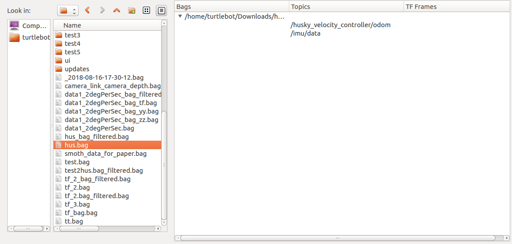

# BagGetFilter
The BagGetFilter utility is a simple, user friendly interface to manipulate rosbags. The user can **play rosbags** or **filter those bags and export topics into CSV format**.


## Installation

Clone the BagGetFilter's remote repository in your computer.

```
git clone http://192.168.1.101/AVL-Summer-18/BagGetFilter
```

## Prerequisites

-ROS(Kinetic) needs to be installed for several of the BagGetFilter's functions to work


## Usage

The executable of the BagGetFilter is located in the "dist" repository. To run it, navigate to the dist repository and type the command:

```
./BagGetFilter
```

Then the main window will appear:


To load a bag file into the application, drag and drop a bag file from the directory viewer on the left to the blank area on the right.  To load multiples bags at the same time hold the "CTRL" key for individual files or the "SHIFT" key for all files between two selections and then drag and drop the selected files.  Loading files can be a little slow with multi-gigabyte bag files.



All of the topics contianed in the bag file(s) will be displayed under the "Topics" column. The clipboard area of the bags will be also populated with some common roslaunch commands. The user will be able to see it by clicking on the "Show Clipboard" button. The "Clear Bags" button clears the bags currently loaded in the application.


In order to select some topics just keep the "CTRL" or "SHIFT" key pressed and click on them.


### Bag Manipulation

There are several ways to edit/play bag files:


 - Play the bags by clicking on the "Play the bag" button

 - Create csv files of the selected topics by clicking on the "Save selected topics to csv files" button. The files will be automatically named but the storage directory has to be specified.

 - Create a new bag with only the selected topics by clicking on the "Save selected topics in a filtered bag" button. The files will be automatically named by keeping the same bag name and adding the suffix specified in the upper line. The storage directory must also be specified.
 


 - If the user wants to manipulate several bags that contain the same topics, they can activate the "Matching Bag/Topic Highlighting" checkbox above the "Play bags" button. Whenever a topic is selected in one bag this topic will be simultaneously selected in all other bags if present.

 - To load a new filtered bag immediately after creation ensure that the "Load filtered bag when done" checkbox is activated/checked.

 - When the checkbox "Remove beginning and ending metadata from bag" is checked, the new filtered or timestamped bag will have its starting timestamp set to the first message's timestamp and its ending timestamp set to the last message's timestamp. If it is not checked, a topic called "/metadata" will be added to the new bag in order to keep the original start and end timestamp of the initial bag.

 - To generate new bags with differents timestamps from the original bag, double-click on the timestamped parameter of one bag and modify it in the tree widget.


### Playing bags

After clicking on the "Play bags" button, the "Play bag" window will appear.


The user will be able to select the bag that they want to playback from the loaded bags. 


Before playing it, they can also specify different playing arguments.


While running the bag, the ouput information will be shown in the plain text area.  To pause the bag, click on the "Pause" button and to stop playback click on the "Stop" button.


When the bag is paused, the user can also move the playback step by step by clicking on the "Step" button, resume with the "Resume" button, or stop playback with the "Stop" button.


##Built With
--------------

 - pyqt5

 - pexcept

 - Python 2.7

 - pyinstaller


##Authors
-----------

- Paul Buzaud


